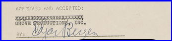
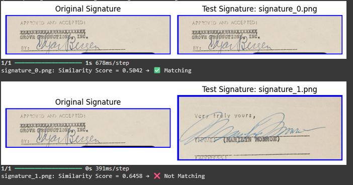
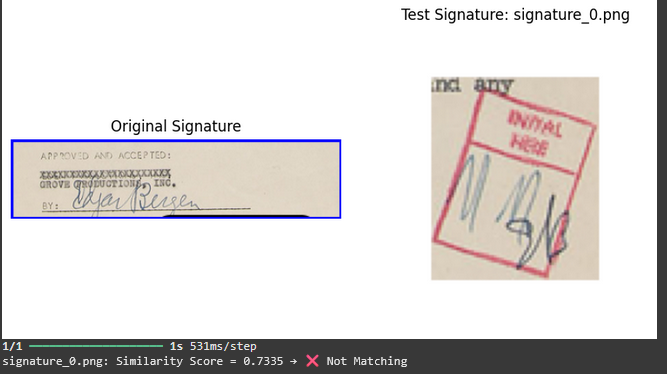

## Signature Verification using Siamese Neural Network

This project uses a Siamese Neural Network to verify handwritten signatures and determine whether a signature is Genuine ✅ or Forged ❌. The model compares two input images and predicts similarity based on learned features.

---

## Model Used: Siamese Neural Network (SNN)

A **Siamese Neural Network** is a special type of neural network used to compare the similarity between two inputs. In this project, each "twin" of the SNN is a **Convolutional Neural Network (CNN)** that extracts features from the two input signature images. The model learns to distinguish genuine and forged signatures based on feature similarity.

---

## Why Siamese Neural Network?

- Works well with **few samples per class** (ideal for signature verification).
- Learns a **distance-based similarity function**, not just classification.
- Effective in **one-shot learning** tasks.
- Generalizes well to **new, unseen signatures** during inference.

---

## Features
- Preprocessing of grayscale signature images
- Siamese CNN architecture for feature extraction
- Custom contrastive loss and cosine similarity
- Real-time prediction with image display
- Accuracy improvements via augmentation & tuning
---

## How it Works 
- Preprocess signature images (resize, normalize).
- Generate pairs of genuine/forged signatures with labels.
- Train a Siamese Network to learn similarity.
- Predict whether a signature matches a reference using a similarity score.
---

## Accuracy


## CNN vs SNN

| Feature                | Convolutional Neural Network (CNN)       | Siamese Neural Network (SNN)                          |
|------------------------|------------------------------------------|--------------------------------------------------------|
| Input                 | Single image                              | Pair of images                                         |
| Output                | Class label                               | Similarity score (0 = Forged, 1 = Genuine)            |
| Task                  | Classification                           | Verification / Similarity Learning                    |
| Data Requirement      | Many samples per class                   | Fewer samples, just similar/dissimilar pairs          |
| Use Case              | Image classification, object detection   | Face/signature verification, one-shot learning        |

---
## Instruction For implementing 
## Step 1: Downlaod the Kaggle Dataset(CEDAR)
 - Here is the link for that=https://www.kaggle.com/datasets/matteocarnebella/cedar-signatures

## Step 2: Open Google Colab

- Mount Google Drive to access the project files.
### Method: Mount via Python Code


Click the third option (icon in Colab file panel) OR run the code below:

```python
from google.colab import drive
drive.mount('/content/drive')
```
## Step 3: Create folder in Drive
 - Create a folder called Data and upload the Kaggle downloaded image
 - The path should be
```python
 drive/
    └── MyDrive/
        └── Data/
            └── signatures/
                └── signatures_1/
                    ├── genuine_1_1.png
                    ├── genuine_1_2.png
                    ├── forgeries_1_1.png
                    └── forgeries_1_2.png
```
## Step 4: Run the cells and downlaod the Model
 - The code for this is =**ipynb/Sure_sign_SNN** run the cell and download the model
  - The model name is **siamese_model2.h5**
  - Create a folder in the drive called **saved_model** and the save the model in the folder 
```
/content/drive/MyDrive/Data/saved_model/siamese_model2.h5
```
## Step 5: Upload the file in the google colab(Document)
  - A python code is bulid to extract the images and put them in different folders are **freehand_signatures** and **boxed_signatures**
  - For extracting the signatures
  - Click the first option in the colab file panel
  - Save the Document file name as **signature.png**


## Step 6: For Verfication and comparing the ouput 
  - Downlaod the original image from the extracted images
  - Same as the 5th step uplaod the original signature **signature1.png**
  - The test images are the **freehand_signatures** and **boxed_signatures**


## Outcome

The model outputs a **similarity score** between two signature images. If the score is above a defined threshold (e.g., 0.6), the signatures are classified as **Genuine**, else **Forged**.
<p align="center">
  <b>Genuine Signature</b>
</p>
<p align="center">
  
</p>

<p align="center">
  <b>Forged Signature</b>
</p>
<p align="center">
  
</p>

---

## Image Extraction and Verification with the Existing model 
- **Signature Extraction Code**: Extract signatures from scanned documents or image files using preprocessing techniques like resizing, thresholding, and contour detection.
- **Original Signature**: The reference image used to verify authenticity.
- **Extracted Signature (Test Image)**: The signature image extracted from input, used for comparison.
- **Load the Trained Siamese Model**: Use the pre-trained Siamese model **(siamese_model.h5)** by loading it with the custom distance function.
- **Verify Signatures**: Compare the original and test signature images using the trained model and check the similarity
  - ✅ If similar → **"Matching"**
  - ❌ If not similar → **"Not Matching"**
- A simple and effective pipeline for real-time signature verification using a ready-to-use deep learning model.
---

## Output of Image extraction and Verification 
<p align="center">
  <b>Orignal Signature</b>
</p>
<p align="center">
  
</p>
<p align="center">
  <b>Test Signature Compared with Original image</b>
</p>
<p align="center">
  
</p>
<p align="center">
  <b>Test Signature Compared with Original image</b>
</p>
<p align="center">
  
</p>


