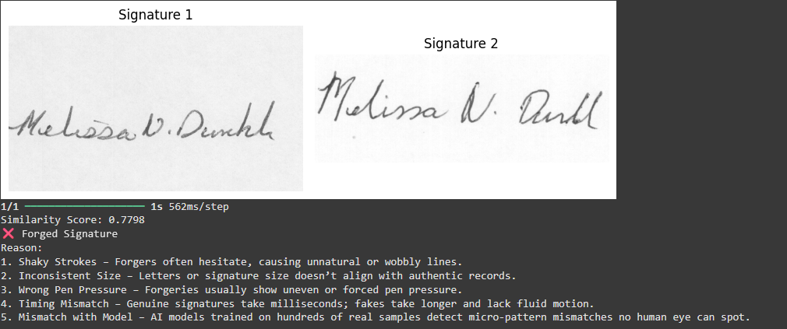
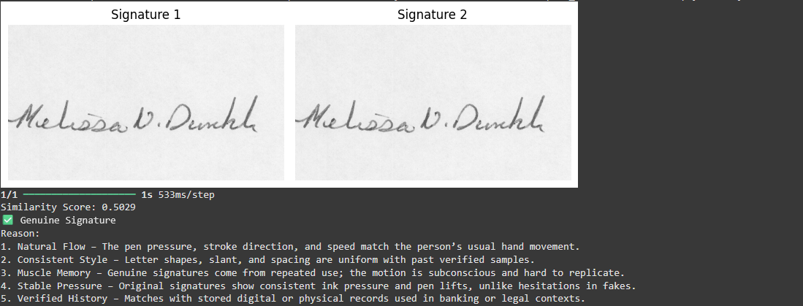

## Signature Verification using Siamese Neural Network

This project uses a Siamese Neural Network to verify handwritten signatures and determine whether a signature is Genuine ✅ or Forged ❌. The model compares two input images and predicts similarity based on learned features.

---

## Model Used: Siamese Neural Network (SNN)

A **Siamese Neural Network** is a special type of neural network used to compare the similarity between two inputs. In this project, each "twin" of the SNN is a **Convolutional Neural Network (CNN)** that extracts features from the two input signature images. The model learns to distinguish genuine and forged signatures based on feature similarity.

---

## Why Siamese Neural Network?

- Works well with **few samples per class** (ideal for signature verification).
- Learns a **distance-based similarity function**, not just classification.
- Effective in **one-shot learning** tasks.
- Generalizes well to **new, unseen signatures** during inference.

---

## Features
- Preprocessing of grayscale signature images
- Siamese CNN architecture for feature extraction
- Custom contrastive loss and cosine similarity
- Real-time prediction with image display
- Accuracy improvements via augmentation & tuning
---

## How it Works 
- Preprocess signature images (resize, normalize).
- Generate pairs of genuine/forged signatures with labels.
- Train a Siamese Network to learn similarity.
- Predict whether a signature matches a reference using a similarity score.
---

## Accuracy

## CNN vs SNN

| Feature                | Convolutional Neural Network (CNN)       | Siamese Neural Network (SNN)                          |
|------------------------|------------------------------------------|--------------------------------------------------------|
| Input                 | Single image                              | Pair of images                                         |
| Output                | Class label                               | Similarity score (0 = Forged, 1 = Genuine)            |
| Task                  | Classification                           | Verification / Similarity Learning                    |
| Data Requirement      | Many samples per class                   | Fewer samples, just similar/dissimilar pairs          |
| Use Case              | Image classification, object detection   | Face/signature verification, one-shot learning        |

---

## Outcome

The model outputs a **similarity score** between two signature images. If the score is above a defined threshold (e.g., 0.5), the signatures are classified as **Genuine**, else **Forged**.

  
  

  <b>Forged Signature</b> &nbsp;&nbsp;&nbsp;&nbsp;&nbsp;&nbsp;&nbsp;&nbsp; <b>Geninue Signature</b>

---

